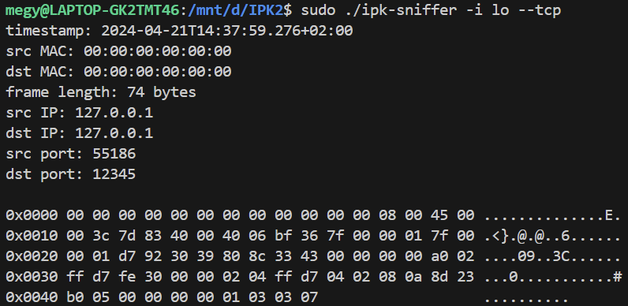
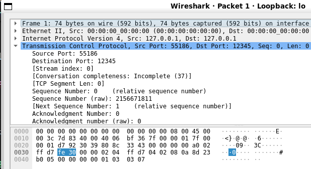
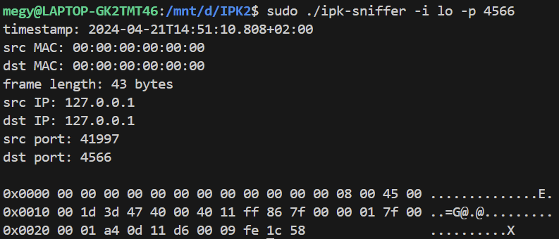
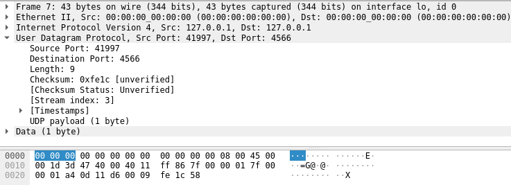

# IPK Packet Sniffer

Packet sniffer vytvorený ako školský projekt do predmetu **Počítačové komunikácie a siete** na VUT FIT.

Aplikácia zachytáva pakety na zvolenom sieťovom rozhraní, umožňuje ich filtrovať podľa protokolu alebo portu a vypisuje základné informácie o každom rámci vrátane hexadecimálneho a ASCII výpisu dát. Je napísaná v C++ s využitím knižnice `libpcap`.

## Obsah

1. [Preklad a spustenie](#preklad-a-spustenie)
2. [Použitie](#použitie)
3. [Návrh a implementácia](#návrh-a-implementácia)
4. [Testovanie](#testovanie)
5. [Problémy a poznámky](#problémy-a-poznámky)
6. [Štruktúra repozitára](#štruktúra-repozitára)
7. [Odkazy](#odkazy)

## Preklad a spustenie

Projekt je určený pre Linuxové prostredie s nainštalovaným C++20 kompilátorom, nástrojom `make` a vývojovým balíkom knižnice `libpcap`.

Na systémoch založených na Debiane/Ubuntu je možné závislosti nainštalovať napríklad takto:

```bash
sudo apt update
sudo apt install build-essential libpcap-dev
```

Preklad:

```bash
make
```

Vyčistenie preložených súborov:

```bash
make clean
```

Zachytávanie paketov väčšinou vyžaduje zvýšené oprávnenia, preto je potrebné program spúšťať cez `sudo`, pokiaľ systém nie je nastavený inak.

## Použitie

Výpis dostupných sieťových rozhraní:

```bash
./ipk-sniffer -i
```

Príklad zachytenia jedného TCP paketu:

```bash
sudo ./ipk-sniffer -i eth0 --tcp
```

Príklad zachytenia piatich UDP paketov na porte `4567`:

```bash
sudo ./ipk-sniffer -i eth0 --udp -p 4567 -n 5
```

Príklad filtrovania podľa zdrojového alebo cieľového portu:

```bash
sudo ./ipk-sniffer -i eth0 --port-source 12345
sudo ./ipk-sniffer -i eth0 --port-destination 443
```

Podporované argumenty:

| Argument | Popis |
| --- | --- |
| `-i`, `--interface` | Sieťové rozhranie. Bez hodnoty vypíše dostupné rozhrania. |
| `-p` | Port, ktorý sa môže nachádzať na zdrojovej alebo cieľovej strane komunikácie. |
| `--port-source` | Filtrovanie podľa zdrojového portu. |
| `--port-destination` | Filtrovanie podľa cieľového portu. |
| `-t`, `--tcp` | Zachytávanie TCP paketov. |
| `-u`, `--udp` | Zachytávanie UDP paketov. |
| `--arp` | Zachytávanie ARP paketov. |
| `--icmp4` | Zachytávanie ICMPv4 paketov. |
| `--icmp6` | Zachytávanie ICMPv6 paketov. |
| `--ndp` | Zachytávanie vybraných NDP správ. |
| `--mld` | Zachytávanie vybraných MLD správ. |
| `--igmp` | Zachytávanie IGMP paketov. |
| `-n` | Počet paketov na zachytenie. Predvolená hodnota je `1`. |

## Návrh a implementácia

Návrh projektu je rozdelený do troch hlavných častí: spracovanie argumentov, zostavenie filtra a samotné zachytávanie a výpis paketov.

Spracovanie argumentov zabezpečuje funkcia `parseArgs` v súbore `parser.cpp`. Pôvodné riešenie založené na `getopt` bolo rozšírené na `getopt_long`, pretože zadanie vyžaduje podporu skrátených aj dlhých foriem argumentov. Načítané hodnoty sa ukladajú do štruktúry `ArgValues_t`, ktorá sa následne odovzdá konštruktoru triedy `Sniffer`.

Trieda `Sniffer` tvorí jadro aplikácie. Z prijatých argumentov zostaví metóda `getFilterString` reťazec vo formáte použiteľnom pre `pcap_compile`. Takto pripravený filter sa aplikuje na otvorené sieťové rozhranie pomocou `pcap_setfilter`.

Zachytávanie paketov prebieha cez funkciu `pcap_loop`, ktorá spracuje požadovaný počet paketov a každý z nich odovzdá callback funkcii. Tá z paketu vyberie informácie požadované zadaním a vypíše ich na štandardný výstup. Kvôli prehľadnosti je formátovanie timestampu, MAC adries, IP adries, portov a dátového obsahu rozdelené do samostatných pomocných funkcií.

Výstup jedného paketu obsahuje najmä:

- čas zachytenia paketu,
- zdrojovú a cieľovú MAC adresu,
- dĺžku rámca,
- zdrojovú a cieľovú IP adresu,
- zdrojový a cieľový port, ak sú pre daný paket dostupné,
- hexadecimálny a ASCII výpis obsahu rámca.

## Testovanie

Testovanie prebiehalo priebežne po dokončení jednotlivých častí a následne aj po spojení celej aplikácie. Po implementácii spracovania argumentov bola kontrolovaná správnosť načítaných hodnôt výpisom na štandardný výstup. Pri zostavovaní filtrov bola testovaná schopnosť aplikácie prijať iba pakety zodpovedajúce zadaným filtrom a zároveň správne reagovať na chyby v `pcap_compile`.

Po dokončení zachytávania paketov bolo možné overiť celkovú funkcionalitu aplikácie. Na testovanie TCP a UDP komunikácie bol použitý `netcat`, ICMPv4 bolo testované pomocou `ping`. Keďže tieto nástroje nepokrývali všetky požadované protokoly, boli doplnené aj študentské testy a vlastný pomocný skript `test.py`, ktorý umožňuje generovať vybrané TCP, UDP a ICMP pakety.

Pomocný skript vyžaduje balík `icmplib` pri ping testoch:

```bash
pip install icmplib
```

Príklady spustenia:

```bash
python3 test.py --tcp
python3 test.py --udp
python3 test.py --ping4
python3 test.py --ping6
```

### Test TCP

Testovanie správneho prijatia TCP paketu a jeho výpisu.




### Test portu

Testovanie schopnosti aplikácie prijať paket na konkrétnom porte.




## Problémy a poznámky

Počas vývoja sa nevyskytli zásadné problémy, skôr menšie implementačné detaily, ktoré bolo potrebné vyriešiť alebo presnejšie pochopiť.

Jednou z dôležitejších častí bolo spracovanie NDP a MLD. Tieto mechanizmy nie sú samostatné transportné protokoly, ale sú realizované cez vybrané typy ICMPv6 správ. Preto bolo potrebné preštudovať ich reprezentáciu v `libpcap` filtroch a doplniť konkrétne hodnoty ICMPv6 typov.

Ďalším detailom bolo spracovanie argumentov v krátkej aj dlhej forme. Tento problém bol vyriešený použitím `getopt_long` a definovaním podporovaných možností v štruktúre `option`.

Pozornosť si vyžiadal aj samotný formát výpisu paketu, najmä timestamp, MAC adresy a rozlíšenie medzi IPv4 a IPv6 adresami.

## Štruktúra repozitára

```text
.
├── main.cpp / main.h          # vstupný bod aplikácie
├── parser.cpp / parser.h      # spracovanie argumentov
├── sniffer.cpp / sniffer.h    # zachytávanie, filtrovanie a výpis paketov
├── test.py                    # pomocný testovací skript
├── docs/assets/               # ukážky z testovania
├── Makefile
├── CHANGELOG.md
├── LICENSE
└── README.md
```

Zdrojové súbory sú ponechané v koreňovom adresári repozitára, keďže ide o menší školský C++ projekt s jednoduchým `Makefile`.

## Odkazy

- [pcap library](https://www.tcpdump.org/)
- [Netcat](https://nc110.sourceforge.io/)
- [Python](https://www.python.org/)
- [TCP](https://en.wikipedia.org/wiki/Transmission_Control_Protocol)
- [UDP](https://en.wikipedia.org/wiki/User_Datagram_Protocol)
- [NDP](https://en.wikipedia.org/wiki/Neighbor_Discovery_Protocol)
- [ICMP](https://en.wikipedia.org/wiki/Internet_Control_Message_Protocol)
- [IGMP](https://cs.wikipedia.org/wiki/Internet_Group_Management_Protocol)
- [MLD](https://en.wikipedia.org/wiki/Multicast_Listener_Discovery)
- [getopt](https://man7.org/linux/man-pages/man3/getopt.3.html)
- [TCP/IP](https://en.wikipedia.org/wiki/Internet_protocol_suite)
